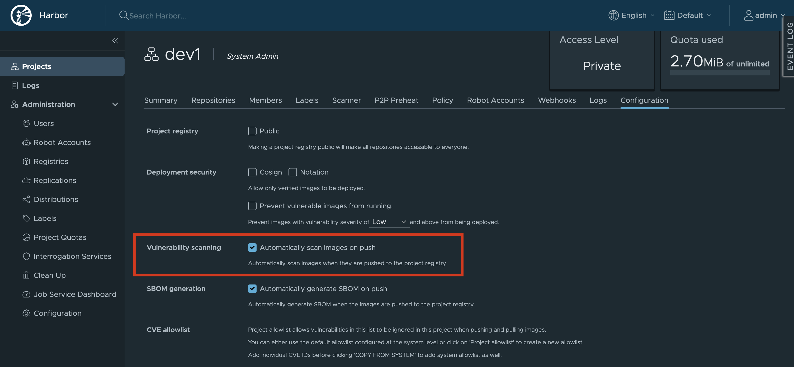

# Harbor SBOM generation and vulnerability scanning

## Prerequisites

- docker installed
- trivy installed
- Harbo registry set up and accessible

### Harbor Regsitry

With the latest Harbor release, Trivy will be installed as the default scanner.

See `Administration < Interrogation Services`


Set up Harbor in your Project section under `Configuration` to automatically trigger vulnerability scanning:




## SBOM -- Automated

1st Create a new project in the UI within `Projects`

Pull a new container image:
```
docker pull alpine:3.15.5
```

Retag the container image:
```
docker image tag alpine:3.15.5 yourinstance/dev2/alpine:3.15.5
```

Note that `yourinstance` is the URL or IP address to your Harbor instance.

Push a new container image to your project:
```
docker push yourinstance/dev3/alpine:3.15.5
```

## SBOM -- Manually

1st Create the SBOM with Trivy:
```
trivy image --format spdx-json --output alpine.spdx.json alpine:3.15.5
```

Add the SBOM manually:
```
trivy referrer put --insecure --subject yourinstance/dev2/alpine:3.15.5  -f alpine.spdx.json
```

